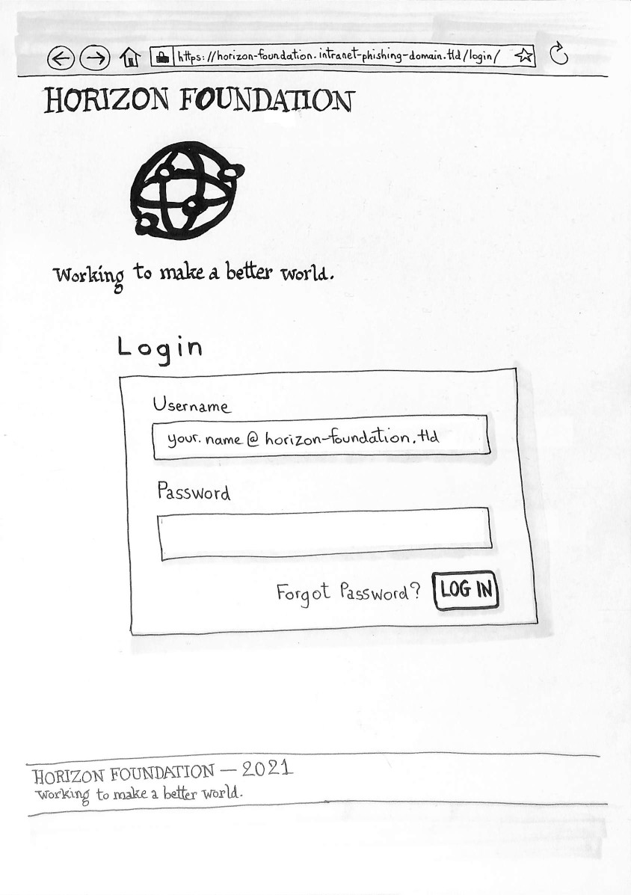

[7. Prototype Design](700-PROTOTYPE-DESIGN.md) > [Scenario #2](700-PROTOTYPE-DESIGN.md#scenario2) > Step 1

## Step 1 of Scenario #2

After clicking the link found in the email,
you arrive to a usual login page.  
Your email is already filled in the Username field.

[Enter your password…](722-SCENARIO2-STEP2.md)
