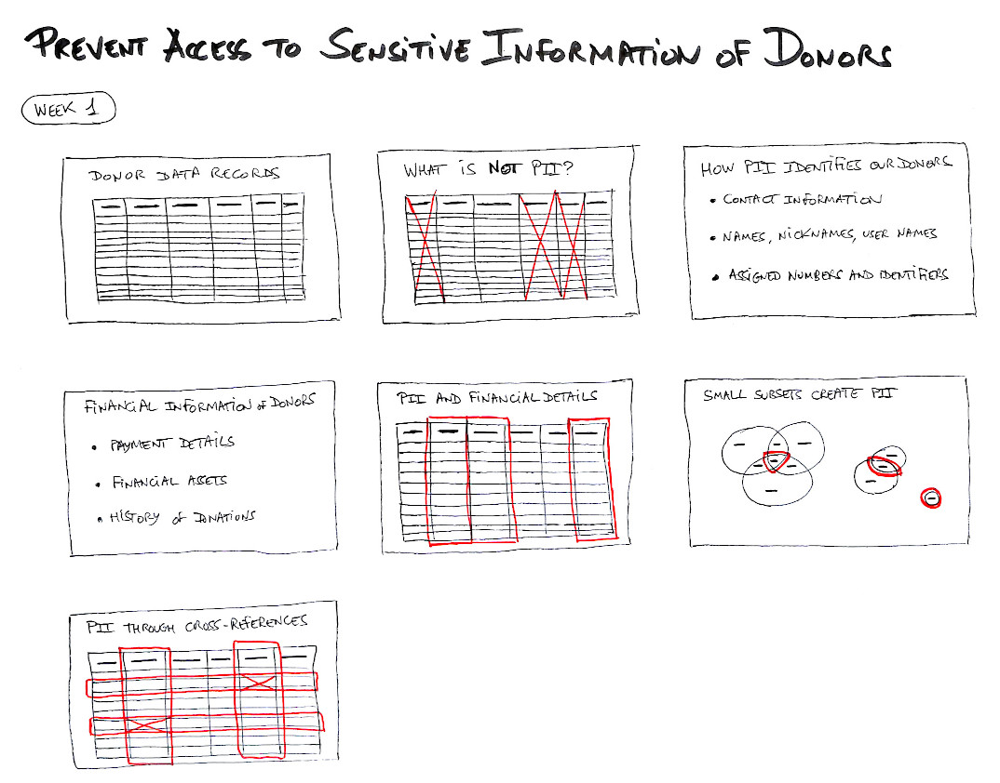

[Contents](README.md) | [8. Storyboards](800-STORYBOARDS.md) | Storyboard #1 | [Next](820-STORYBOARD2.md)

## Storyboard #1: Prevent Access to Sensitive Information of Donors

The first storyboard presents a high-level, visual overview
of the learning experience for the first subgoal:

* [Storyboard #1: Prevent Access to Sensitive Information of Donors](810-storyboard1.pdf)

While this experience may be supported by the development of e-learning
resources, we recommend to put the emphasis on hands-on activities
working with actual administration software and realistic data as much
as possible. For example, an activity may start with a presentation of the
concepts to learn, as self-paced e-learning or a few presentation slides.
It shall then continue with a practice activity to illustrate and experience
the concepts in play. We envision a ratio of 20% theory and 80% practice
for this course.

[Contents](README.md) | [8. Storyboards](800-STORYBOARDS.md) | Storyboard #1 | [Next](820-STORYBOARD2.md)
