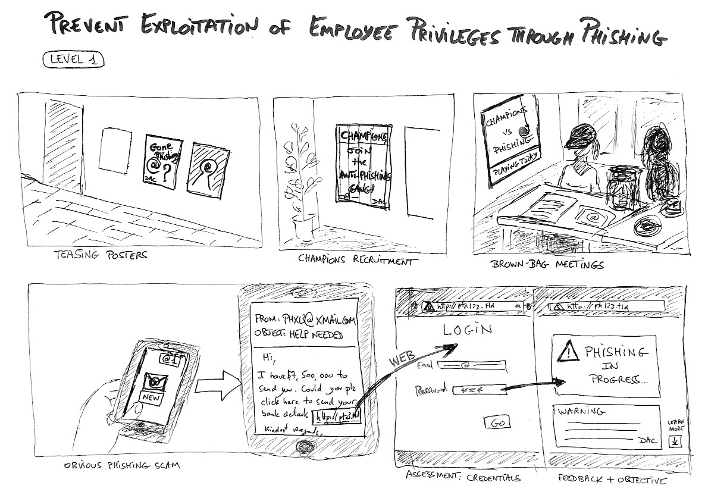

[Contents](README.md) | [8. Storyboards](800-STORYBOARDS.md) | [Previous](810-STORYBOARD1.md) | Storyboard #2

## Storyboard #2: Prevent Exploitation of Employee Privileges through Phishing Scams

* [Storyboard #2: Prevent Exploitation of Employee Privileges through Phishing](820-storyboard2.pdf)

In *The Conditions of Learning*, Robert M. Gagné describes 9 events
that support efficient learning. He lists them in the following order,
but remarks that the numbering only indicates *an approximate typical order*.
These events of instruction may occur in a different order and are not
necessarily present in every lesson:

  1. Gaining attention,
  2. Informing learners of the objective,
  3. Stimulating recall of prior learning,
  4. Presenting the stimulus,
  5. Providing learning guidance,
  6. Eliciting performance,
  7. Providing feedback,
  8. Assessing performance,
  9. Enhancing retention and transfer.

We have found convenient to split these 9 events evenly into 3 groups which
correspond to three moments in a typical lesson: start, middle and end.

  * **Start**
    - 1\. Gaining attention,
    - 3\. Stimulating recall of prior learning,
    - 2\. Informing learners of the objective
  * **Middle**
    - 5\. Providing learning guidance,
    - 4\. Presenting the stimulus,
    - 6\. Eliciting performance
  * **End**
    - 7\. Providing feedback,
    - 8\. Assessing performance,
    - 9\. Enhancing retention and transfer.

The storyboard highlights the instructional events involved at each step
of the instructional phishing tests and the associated learning journey.
These tests have been design to train the Horizon Foundation workforce
to fight phishing on the go.

You may notice that the first instructional events (attracting attention,
stating the objective, recalling prerequisites) are not performed for each
individual learner, but at the level of the organization as a whole, through
posters and a select group of learning champions.

Then for the phishing practice targeting individual volunteers and employees,
the order of instructional events is atypical:

  * **Before: Instructional Phishing Email**
    - 4\. Plain Stimulus, *Without* Emphasis,
    - 8\. Assessment,
    - 9\. Spaced Reviews and Generalization.

  * **After: (Only when Failing the Test) Instructional Scam**
    - 1\. Attracting Attention,
    - 7\. Feedback,
    - 2\. Statement of Performance Objective,
    - 5\. Learning Guidance.

That is because the goal of this particular training is to
**learn to notice the unexpected**. The emphasis usually given
to the content to be learned would prove detrimental for this
learning objective.

[Contents](README.md) | [8. Storyboards](800-STORYBOARDS.md) | [Previous](810-STORYBOARD1.md) | Storyboard #2
